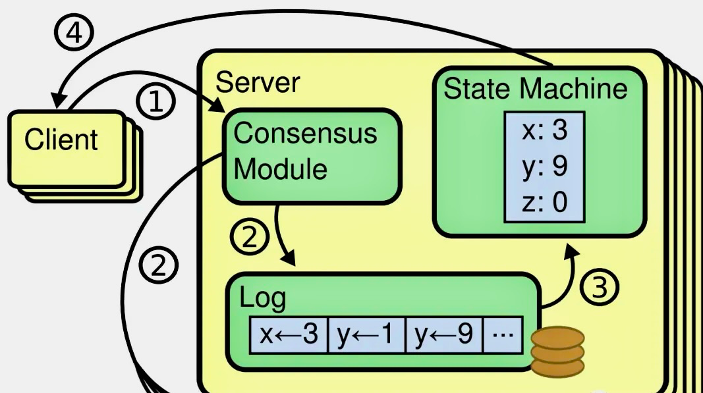

# rafting

## Raft 是什么？
>Raft is a consensus algorithm for managing a replicated log. It produces a result equivalent to (multi-)Paxos, and it is as efficient as Paxos, but its structure is different from Paxos; this makes Raft more understandable than Paxos and also provides a better foundation for building practical systems.  
>--《In Search of an Understandable Consensus Algorithm》

在分布式系统中，为了消除单点提高系统可用性，通常会使用副本来进行容错，但这会带来另一个问题，即如何保证多个副本之间的一致性？

这里我们只讨论强一致性，即线性一致性。弱一致性涵盖的范围较广，涉及根据实际场景进行诸多取舍，不在 Raft 系列的讨论目标范围内。

所谓的强一致性（线性一致性）并不是指集群中所有节点在任一时刻的状态必须完全一致，而是指一个目标，即让一个分布式系统看起来只有一个数据副本，并且读写操作都是原子的，这样应用层就可以忽略系统底层多个数据副本间的同步问题。也就是说，我们可以将一个强一致性分布式系统当成一个整体，一旦某个客户端成功的执行了写操作，那么所有客户端都一定能读出刚刚写入的值。即使发生网络分区故障，或者少部分节点发生异常，整个集群依然能够像单机一样提供服务。

共识算法（Consensus Algorithm）就是用来做这个事情的，它保证即使在小部分（≤ (N-1)/2）节点故障的情况下，系统仍然能正常对外提供服务。共识算法通常基于状态复制机（Replicated State Machine）模型，也就是所有节点从同一个 state 出发，经过同样的操作 log，最终达到一致的 state。

 
图：Replicated State Machine

共识算法是构建强一致性分布式系统的基石，Paxos 是共识算法的代表，而 Raft 则是其作者在博士期间研究 Paxos 时提出的一个变种，主要优点是容易理解、易于实现，甚至关键的部分都在论文中给出了伪代码实现。